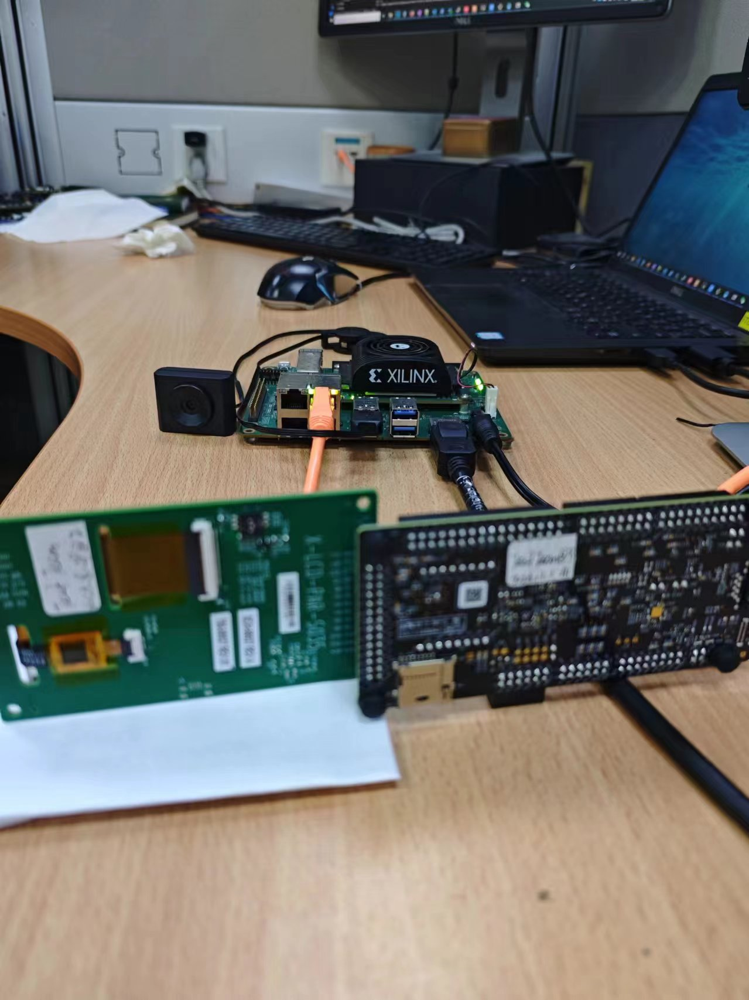
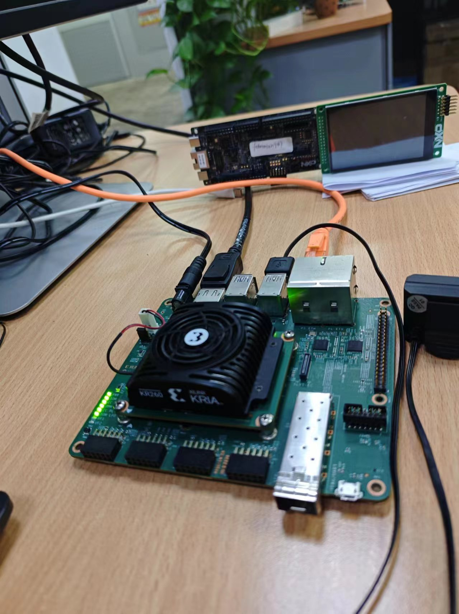
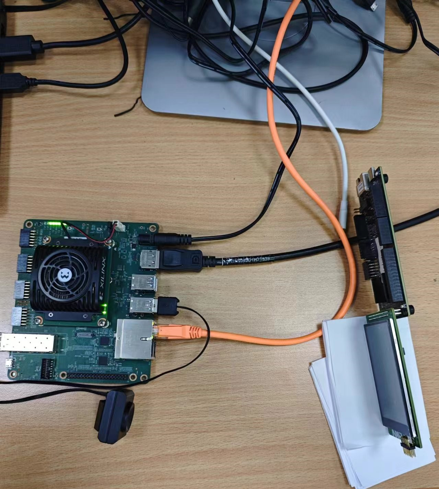

# Recognise images of test panel.
## Overview
We have a validation task named 'Graphic Test' for MCU SDK demos/examples test. 
1. The test steps are:
- Connect mcu board to PC.
- Connect specify panel(such as ) to mcu board.
- Download and run our SDK demo, then check the display on the panel by tester manually.

2. The goal of this project is to replace manual inspection of panel displays with test scripts.
Test ENV will be like below picture:

Hareware connection picture1:

Hareware connection picture1:

Hareware connection picture1:

- When the SDK demo start to run on mcu board, a picture of cat will display on the panel.
- Capture the pictures of panel display by a USB HD camera.
- Recognise the pictures captured by the camera with PYNQ + kr260_cifar10_tf2_resnet18.xmodel.
- Print the result.

## Technology
1. Hardwares:
- KR260
- USB HD camera
- nxp mcu board frdmmcxn947
- panel X-LCD-PAR-S035

2. Software used:
- PYNQ + kr260_cifar10_tf2_resnet18.xmodel

